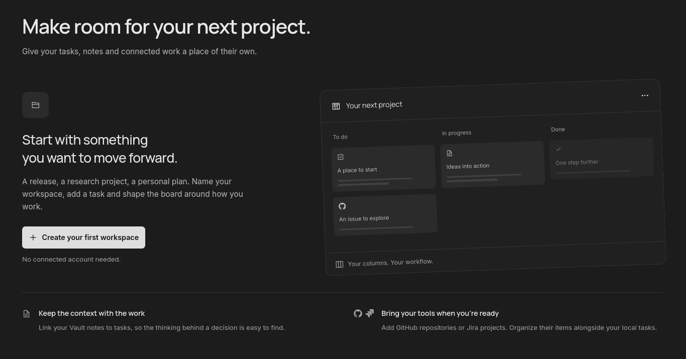
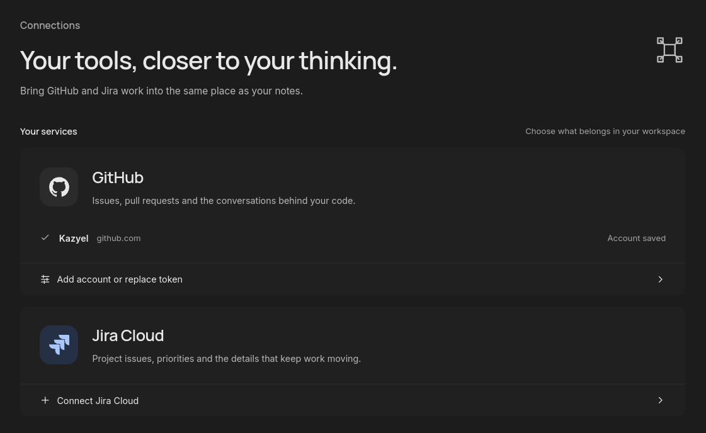

<p align="center">
  
</p>

<h1 align="center">Adamant</h1>

<p align="center">
  Your notes, documents, and project work. Together on your desktop.
</p>

<p align="center">
  <a href="#what-you-can-do">Features</a> ·
  <a href="#getting-started">Getting started</a> ·
  <a href="#development">Development</a> ·
  <a href="#architecture">Architecture</a> ·
  <a href="#roadmap">Roadmap</a>
</p>

Adamant is a local-first desktop workspace for the context behind your work. Write Markdown, read documents, and organize tasks alongside GitHub issues, pull requests, and Jira projects. Keep the notes behind a decision close to the task that needs them.

Your files live in a **Vault**, a portable folder you control. Accounts are optional: you can write and organize local tasks without connecting a service.

**Early development.** Vaults, Markdown, document previews, and project workspaces are implemented. Linux is the currently verified desktop target. Adamant is also a personal learning project; live provider writes and cross-platform releases still need broader verification.



## What you can do

### Write and read in one place

Choose **Dark graphite** or **Cool white** in **Preferences → Appearance**, then save preferences. Both themes separate the writing surface, cards, and overlays with restrained shadows and edge lighting. The editor and Markdown preview follow the selected palette; original PDF and DOCX pages retain their document colors. The welcome crystal stays silver in both themes, including its static fallback. The desktop app remembers the choice. Existing preferences default to dark. Text fields and searches share the sidebar’s input styling across dialogs, connections, tasks, preferences, and editor search, including keyboard focus and reduced-motion support.

- Edit Markdown with undo history, search, reading preview, and split view.
- Open PDF and DOCX documents alongside your notes. PDF supports navigation, zoom, and text selection. DOCX previews separate pages using document breaks and available page height, including long paragraphs and tables. Layout remains approximate; oversized objects and merged table rows may extend a page. Markdown editing and saving controls appear only for Markdown.
- Browse, filter, import, and organize files in a Vault, with Trash and recovery workflows.
- Resume your last Vault and document session when you reopen the app.

Markdown saves explicitly with **Ctrl+S / ⌘S**. External changes, unsaved edits, and recovery copies remain visible. Original PDF and DOCX files stay unchanged; open them in an external application when layout fidelity matters.

In a Vault PDF or DOCX, use **New note**, **Link existing note**, and **Notes** in the document toolbar. Creating and linking notes use separate dialogs. **Notes** opens a drawer containing only linked notes, with the same search field as the sidebar. Select a note to open it in the main editor; saving uses the disk icon or Ctrl+S / ⌘S. On narrow windows the drawer appears below the document. A Note can belong to several documents. Use **Sources** in a Note to return to its originals. Unlinking removes the association and keeps the Note.

Annotation links use stable identities in the document's companion metadata and travel with the Vault. Missing or duplicate targets remain visible as unresolved references. Linking existing Notes requires a ready inventory; creating annotations and unlinking remain available with incomplete indexing. Changes reject stale metadata. These annotations apply to the whole document; page highlights and anchored selections are not included.

### Give each project its own workspace

Create a workspace for a release, research project, or personal plan. Use a board or list, customize its columns, and add local tasks with checklists, priorities, due dates, and links to your notes.

Local task drawers put the editable title first, followed by priority, due date, description, and checklist progress. Notes and links stay below the task; expand **Add a note or link** when you need to attach a reference.

The workspace hub shows the item total for each Kanban column alongside its sources, with search by project name or source. Open a card for its detail drawer. Share an item across workspaces while keeping its column position independent in each one.

Workspace changes save automatically. Personal columns describe your organization: **moving a card does not change its status in GitHub or Jira**.

### Connect the work you already have

Connect GitHub or Jira Cloud, then choose which repositories, projects, or individual items to follow. Review discussions and pull-request changes without leaving your workspace. Saved snapshots and unsent drafts keep context available offline.



Tokens stay in the operating system's secure credential store, never in your Vault. Comments, supported provider edits, reviews, and merges use explicit actions. Sensitive actions require confirmation, and failed remote writes are not retried automatically.

## Getting started

### Requirements

The current development and local installation workflow targets Linux.

| Tool             | Version or requirement                                                                      |
| ---------------- | ------------------------------------------------------------------------------------------- |
| Bun              | **1.4.2**, pinned in [package.json](package.json)                                           |
| Node.js          | **24.14.1**, pinned in [.node-version](.node-version)                                       |
| Rust             | **1.98.1**, with Cargo, Clippy, and rustfmt; see [rust-toolchain.toml](rust-toolchain.toml) |
| Native libraries | GTK 3 and WebKit2GTK 4.1 development libraries, plus a desktop session                      |
| Account storage  | An unlocked Secret Service collection on the session D-Bus for Linux credentials            |

Follow the [Tauri 2 prerequisites](https://v2.tauri.app/start/prerequisites/) for your distribution. External document opening also needs an application associated with the file type.

### Run the desktop app

```sh
git clone https://github.com/Kazyel/adamant.git
cd adamant
bun install --frozen-lockfile
bun run tauri dev
```

### Install from your checkout

```sh
bun run app:update
```

This builds the current local source in release mode and installs Adamant in your applications menu, without sudo. It does not pull Git changes or download a published release.

- Executable and icon: `${XDG_DATA_HOME:-$HOME/.local/share}/adamant/app/`
- Launcher: `applications/io.adamant.desktop.desktop` under the same data directory.

A failed build leaves the installed version untouched. Close and reopen a running instance to use the new build. The command does not restart the app or modify your Vaults.

To build an executable without installing it:

```sh
bun run tauri build --no-bundle
./native/target/release/adamant
```

This is a local executable, not an AppImage or portable installer. The release app needs the Linux runtime libraries, but does not need the development server.

### Start your first project

1. Choose **Create Vault…**, select a parent folder, and name your Vault. Adamant creates a new child folder; use **Open Vault…** for an existing Vault.
2. Create a **New Note** or import Markdown, PDF, or DOCX files.
3. Open **Project workspace** from the ribbon and create a workspace. Add a local task to start organizing work.
4. To bring in remote items, connect an account under **Connections**, then open **Workspace actions → Manage sources** inside your workspace.

**Add → Follow a work URL** follows an individual GitHub issue, pull request, or Jira issue. Repository and project sources support optional GitHub search qualifiers or Jira JQL.

Use the **Refresh GitHub** icon beside the workspace actions menu to fetch the latest items from its GitHub sources without opening **Manage sources**. The icon rotates while fetching; a warning icon opens sources that need attention.

## Development

### Commands

Run commands from the repository root. Use Bun for dependency management and scripts; `bun.lock` is the only JavaScript lockfile.

| Command             | Purpose                                               |
| ------------------- | ----------------------------------------------------- |
| `bun run tauri dev` | Run the desktop app with native capabilities          |
| `bun run dev`       | Start the Vite browser preview on `127.0.0.1:1420`    |
| `bun run build`     | Check TypeScript and build frontend production assets |
| `bun run typecheck` | Check TypeScript, tests, and Vite configuration       |
| `bun run lint`      | Run type-aware Oxlint; warnings fail                  |
| `bun run lint:rust` | Run Clippy for all native targets                     |
| `bun run fmt`       | Format with Oxfmt and rustfmt                         |
| `bun run fmt:check` | Check formatting without changing files               |
| `bun run test:ts`   | Run TypeScript tests with Node's test runner          |
| `bun run test:rust` | Run native library tests with Cargo                   |
| `bun run test`      | Run both test suites                                  |
| `bun run knip`      | Find unused files, exports, and dependencies          |
| `bun run check`     | Run formatting, lint, type checks, tests, and Knip    |

Use **`bun run test`**, not `bun test`. The project keeps Node and Cargo as its test runners.

The browser preview is useful for frontend work, but cannot access Tauri file pickers, Vault data, credentials, or native workspaces. Test those flows in the desktop app. Vite currently reports production chunks above its size warning threshold.

### Install or update locally on Linux

With the prerequisites and dependencies installed through Bun, run from this checkout. Limit Cargo's parallel jobs because a release build uses substantial CPU and memory.

```sh
CARGO_BUILD_JOBS=2 bun run app:update
```

This builds the current source in release mode and installs Adamant in the applications menu without `sudo`. Close and reopen an existing Adamant session to use the new build.

### Before submitting changes

Run `bun run check` and `bun run build`. For visual changes, inspect the rendered interface and affected states, including keyboard navigation and reduced motion. Distinguish browser tests with simulated data from desktop tests and real provider operations.

`bun install` installs the Lefthook pre-commit hook. It checks staged files for formatting and lint without rewriting or staging them. Use `bun run prepare` to reinstall the hook. CI runs frontend and native checks, the frontend build, and dependency audits. Neither hooks nor CI install the desktop app.

Use `bun add` or `bun remove` to change dependencies and include the updated `bun.lock`. Configure your editor for Oxc and rust-analyzer. If rust-analyzer cannot find the standard library, install `rust-src` through your Rust toolchain manager.

Dependency audits run separately from `bun run check` and require network access:

```sh
cargo install --locked cargo-audit --version 0.22.2
bun run audit:js
bun run audit:rust
```

Read [AGENTS.md](AGENTS.md) for repository conventions, validation requirements, and the local app update workflow.

## Architecture

Adamant uses **React, TypeScript, and Vite inside Tauri 2**, with a Rust native core. CodeMirror handles Markdown editing; Marked and DOMPurify provide the reading preview. PDF.js and docx-preview render documents. SQLite holds a derived local index.

| Location                    | Responsibility                                                     |
| --------------------------- | ------------------------------------------------------------------ |
| `ui/app/`                   | Application composition, sidebar, navigation, and shell styles     |
| `ui/features/workspace/`    | Vault sessions, open documents, saves, conflicts, and recovery     |
| `ui/features/work-context/` | Project workspaces, boards, local tasks, and provider item details |
| `ui/features/connections/`  | Account setup and verification UI                                  |
| `ui/features/markdown/`     | Editor, source preservation, reading preview, and related tests    |
| `ui/features/documents/`    | PDF and DOCX viewers                                               |
| `ui/features/navigation/`   | Search and navigation UI                                           |
| `ui/features/interaction/`  | Menus, dialogs, selectors, calendars, and overlay behavior         |
| `ui/shared/`                | Components and utilities reused across features                    |
| `native/src/vault/`         | Filesystem access, identity, persistence, inventory, and indexing  |
| `native/src/connections/`   | GitHub and Jira requests, account identity, and credential storage |
| `native/src/documents/`     | Native document selection, reads, and external opening             |
| `schemas/`                  | Vault, Note, and document metadata schemas                         |
| `scripts/app-update.mjs`    | Release build and local desktop installation                       |

### Data boundaries

A Vault is the source of truth. New Vaults contain `vault.json` and a `content/` directory; existing layouts remain supported without automatic migration. Markdown Notes preserve their identity, metadata, BOM, and original line endings. The index can be rebuilt from the files.

Portable project state lives in `.adamant/work-context.json`, including workspaces, local tasks, followed-item summaries, links, and unsent drafts. Detailed remote snapshots use a bounded, machine-local cache. Tokens remain in the OS credential store.

The frontend calls specific native commands rather than receiving unrestricted filesystem access. Imported content is untrusted: previews use sanitization and isolation, and document scripts and remote resources are blocked. Preserve save, conflict, recovery, and explicit remote-action guards when extending these flows.

Read the [Vault contract](docs/vault-contract.md) before changing persistence, formats, identity, or recovery. It also documents limits, cache behavior, and platform constraints.

## Roadmap

| Stage     | Scope                                                                      | Status                                        |
| --------- | -------------------------------------------------------------------------- | --------------------------------------------- |
| M0        | Native, editor, document, and credential validation                        | Approved                                      |
| M1 / M1.1 | Vaults, Markdown, saving, recovery, and file workflows                     | Implemented                                   |
| M2        | Project workspaces, GitHub and Jira context, and explicit provider actions | Implemented; verification remains scoped      |
| M3        | Document library and documentation capture                                 | Annotation links implemented; capture planned |
| M4        | Knowledge navigation and relationships                                     | Planned                                       |
| M5        | Local calendar and iCalendar support                                       | Planned                                       |
| M6        | Today view for priorities and activities                                   | Planned                                       |
| M7        | Portable desktop release                                                   | Planned                                       |

A due-date picker is available for tasks; the local calendar milestone is still planned. Remote item creation, GitHub inline reviews, in-app PDF/DOCX editing, Google Calendar synchronization, and a plugin platform are outside the current implemented scope.

See the [implementation plan](docs/implementation-plan.md) for milestone scope and verification records. Planned features are not available merely because their formats or dependencies appear in the design documents.

## License

Adamant is licensed under the [MIT License](LICENSE). Third-party dependencies and assets retain their own licenses. Bundled fonts work offline; their redistribution notices are in [public/licenses](public/licenses/).
