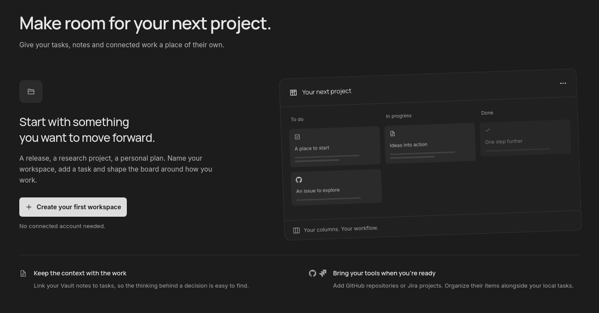
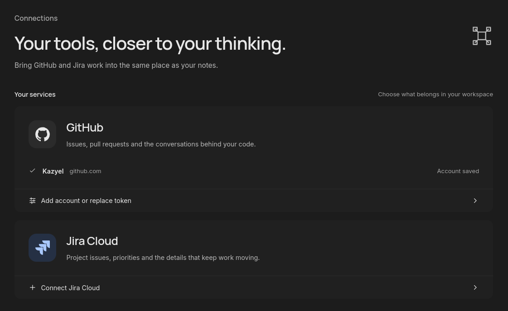

<p align="center">
  
</p>

<h1 align="center">Adamant</h1>

<p align="center">
  Your notes, documents, and project work. Together on your desktop.
</p>

<p align="center">
  <a href="#what-you-can-do">Features</a> ·
  <a href="#getting-started">Getting started</a> ·
  <a href="#development">Development</a> ·
  <a href="#architecture">Architecture</a> ·
  <a href="#roadmap">Roadmap</a>
</p>

Adamant is a local-first desktop workspace for the context behind your work. Write Markdown, read documents, and organize tasks alongside GitHub issues, pull requests, and Jira projects. Keep the notes behind a decision close to the task that needs them.

The standalone [landing page](site/index.html) introduces the app without relying on Tauri. Preview it with `bun run site:dev` and build deployable static files with `bun run site:build`.

Your files live in a **Vault**, a portable folder you control. Accounts are optional: you can write and organize local tasks without connecting a service.

**Early development.** Vaults, Markdown, document previews, and project workspaces are implemented. Linux is the currently verified desktop target. Adamant is also a personal learning project; live provider writes and cross-platform releases still need broader verification.



## What you can do

### Write and read in one place

Preferences opens in a spacious panel with separate sections for appearance, the Markdown editor, reading, and how notes open. Font previews update as you adjust the controls. Save and Cancel stay visible while the settings scroll; changes apply only after you save. Switching sections keeps your draft, and an invalid field brings you back to its section before saving.

Choose **Dark graphite** or **Cool white** in **Preferences → Appearance**, then save preferences. Both themes separate the writing surface, cards, and overlays with restrained shadows and edge lighting. The editor and Markdown preview follow the selected palette; original PDF and DOCX pages retain their document colors. The welcome crystal stays silver in both themes, including its static fallback. The desktop app remembers the choice. Existing preferences default to dark. Text fields and searches share the sidebar’s input styling across dialogs, connections, tasks, preferences, and editor search, including keyboard focus and reduced-motion support. Checkboxes, numeric steppers, search clear buttons, disclosure arrows, and tooltips use shared controls in both themes. Invalid forms show an inline message and focus the first invalid field.

- Edit Markdown with undo history, search, reading preview, and split view. In **Preferences**, choose independent fonts and text sizes for **Markdown editor** and **Markdown reading**. **Appearance → Interface font** changes menus, tabs, dialogs, workspace headings, and graph labels. Each font control includes **Installed font…**: enter the exact family name from your system's font manager to use any installed local font. Font previews update before saving; **Save preferences** applies and remembers the choices. Missing local fonts fall back to bundled Inter. Choose **Adamant default** for the interface to restore its original typography. Inter, [Libron](https://github.com/nicoverbruggen/libron), and JetBrains Mono are bundled locally for offline use. Defaults are Inter in the editor and Libron in reading and split previews. Reading headings scale with text size; code keeps its monospace font. Libron's regular, bold, italic, and bold italic faces are from v0.25 under the SIL Open Font License; their license and copyright notices are in `assets/fonts/libron/`.
- Open PDF and DOCX documents alongside your notes. PDF supports navigation, zoom, and text selection. Hold **Ctrl** and scroll over a PDF or DOCX preview to zoom smoothly in or out from 50% to 200%, keeping the document visible and the point under the cursor in place. Scrolling without Ctrl continues to move through the document. DOCX previews separate pages using document breaks and available page height, including long paragraphs and tables. Layout remains approximate; oversized objects and merged table rows may extend a page. Markdown editing and saving controls appear only for Markdown.
- Browse, filter, import, and organize files in a Vault, with Trash and recovery workflows. Successful deletion clears Explorer selection, copied or cut paths, and navigation targets for the removed items. Clean tabs close; tabs with unsaved text remain available for a recovery copy without offering actions on the deleted file. Restoring an item also clears its selection in Trash.
- Resume your last Vault and document session when you reopen the app. Saved expanded folders that are absent from a ready inventory are cleared quietly. Use the close button to dismiss workspace notifications.

Markdown editing and reading are available with the initial app bundle, without a component-loading screen. Switching to a restored tab keeps the current document visible until the next file is ready. The Explorer shows files progressively during initial indexing, preserving the rows already displayed.

Markdown editing and reading use centered columns, hide their main scrollbars, and show fades at the top and bottom when more content remains in that direction. The editor keeps the caret away from faded edges when scrolling it into view; search controls remain clear. Scrolling, keyboard navigation, text selection, and horizontal scrolling inside code blocks and tables remain available.

The document toolbar separates view modes, sources and links, and file actions with spacing and dividers. Actions use icons with tooltips.

Turn off **Preferences → Appearance → Show document tabs** to remove the entire tab bar and give the editor and other views more vertical space. Documents and unsaved edits stay open. Minimize, maximize, and close move to the upper-right corner of the current view, alongside its existing header. Drag the unused header area to move the window. Turn the preference back on to show the tabs for documents still open in the current session. While tabs are hidden, Adamant does not save or reopen document tabs across restarts, including the last standalone file. Vault recovery drafts and navigation history remain available. The choice persists across restarts.

Press **Ctrl+P / ⌘P** to switch to an open document or find a Vault file. Open documents include unsaved drafts and files outside the Vault, with their current state shown in the list. **Ctrl+Tab** and **Ctrl+Shift+Tab** cycle through open documents, including when tabs are hidden. Switching retains unsaved edits and waits for restored documents to open. Saving, closing the active document, and changing its editing view apply in the document workbench. **Alt+← / Alt+→** return to the workbench when navigating document history.

Markdown saves explicitly with **Ctrl+S / ⌘S**. External changes, unsaved edits, and recovery copies remain visible. Original PDF and DOCX files stay unchanged; open them in an external application when layout fidelity matters.

The document footer shows only saving state and actionable indexing warnings. Saved notes use a quiet indicator; pending changes and conflicts stand out. It omits format labels and stays hidden for PDF/DOCX when there is no warning.

In the Explorer's **New Note** form, choose **Blank note**, **Technical decision**, **Meeting**, or **Study** under **Template**. The selected template supplies editable Markdown sections. Creating the note assigns a fresh UUID through the normal Vault creation flow. Section names and learning prompts remain optional; you can rename or remove them.

In a Vault PDF or DOCX, use the **New note**, **Link existing note**, and **Show annotations** toolbar icons. Hover over an icon or focus it with the keyboard to see its tooltip. Creating and linking notes use separate dialogs. **Show annotations** opens a drawer containing only linked notes, with the same search field as the sidebar. Select a note to open it in the main editor; saving uses the disk icon or Ctrl+S / ⌘S. On narrow windows the drawer appears below the document. A Note can belong to several documents. Use **Source documents** in a Note to return to its originals. Unlinking removes the association and keeps the Note.

Annotation links use stable identities in the document's companion metadata and travel with the Vault. Missing or duplicate targets remain visible as unresolved references. Linking existing Notes requires a ready inventory; creating annotations and unlinking remain available with incomplete indexing. Changes reject stale metadata. These annotations apply to the whole document; page highlights and anchored selections are not included.

### Link notes as you write

While editing a saved Vault note, press **Ctrl+K / ⌘K**. Search by title or path and select a note. Selected text becomes the link label; otherwise Adamant uses the note title. The insertion uses ordinary relative Markdown, participates in editor undo, and saves with **Ctrl+S / ⌘S**. Follow the link in reading or split view to open its destination.

Use the **Backlinks** toolbar icon (an arrow entering a document) to see which saved notes link to the current note, including a source excerpt. Select a backlink to open its source at the reference. Expand the outgoing links to inspect destinations and unresolved references. Unsaved edits are not indexed; save to update links from that note. Partial indexing and result limits remain visible.

The backlinks list stays visible while refreshing and after a refresh error. Use **Show more backlinks**, **Show more outgoing links**, or **Show more notes** in the link picker to expand each list independently. These controls extend the displayed results; partial analysis remains identified separately.

Backlinks are derived from Markdown links, including reference-style links. Code examples, images, external URLs, and same-page fragments do not create note backlinks. These links also appear in the graph. Manual graph connections and document annotation associations keep their own storage. Moves made through Adamant update supported local Markdown links; external moves can leave unresolved paths. No backlink file is added to the Vault.

### Search document content

Use **Ctrl+Shift+F / ⌘Shift+F** and choose **Document content** to search saved Markdown plus extractable PDF and DOCX text. PDF results show the matching page and open the original there. Back/Forward history and restored sessions retain that page. Adamant verifies the source bytes before applying a search position; a changed PDF requires a new search. DOCX results show an excerpt and open the original without an exact page position. DOCX extraction includes the main body and tables. Scanned PDFs need OCR, which is not included. Encrypted, unreadable, empty, or oversized sources remain viewable where supported and report incomplete search coverage.

Extraction reads originals without modifying them. It accepts up to 16 MiB per PDF/DOCX source, 8 MiB of extracted text, and 256 PDF pages. A two-second budget is checked between parser operations; cancellation does not interrupt a parser call already running. Text caches are bounded separately: 256 MiB for Markdown and 64 MiB for extracted documents. See the [Vault contract](docs/vault-contract.md#m11-workspace-and-recovery) for search and reference limits.

Known file changes invalidate only their cached text and references. Unchanged documents stay indexed; a full reconciliation rebuilds the derived caches. Search pages stay tied to the inventory generation, and partial results expose a continuation action.

### Organize documents with tags and filters

Open a Vault document and use **Document tags** in the toolbar. Add tags with suggestions from the Vault, then choose **Save tags**. Save pending Markdown edits and resolve conflicts before changing tags. Markdown needs valid identity metadata; adopt an unmanaged note explicitly before adding tags. PDF and DOCX tags use companion metadata and leave the original files unchanged.

Tags match exactly, including case. Each save accepts up to 64 tags, with 1–128 UTF-8 bytes per tag. Existing larger lists remain readable. Metadata edits preserve unrelated fields, comments, the Markdown body, BOM, and line endings. Stale revisions and YAML layouts that cannot be edited safely produce an error without replacing the source.

In **Search Vault**, open the funnel button (**Show filters**) to combine a **Folder**, file types, and **Must have tags**. The graph sidebar has the same filters under the collapsible **Filters** section. A folder includes its descendants. Documents must contain every selected tag and match any selected file type. Leaving the type selection empty includes every supported type. Folder and tag suggestions come from the current inventory, so incomplete indexing can omit suggestions. Filters also work without a text query. Use **Clear filters** to remove them.

### Connect files in an interactive graph

Open **Graph** in the ribbon to see the Vault's Markdown, PDF and DOCX files. Adamant prepares the graph in the background after the active document opens. The graph has no loading screen and keeps existing nodes visible during refreshes. Click a node to select it and highlight its connections. Click it again to clear selection without changing the camera position or zoom; Shift+click opens its file. The file sidebar starts closed each time you open the graph, in both global and local views. Use the right-panel button in the graph header to show or hide it, or its × button to close it. The sidebar floats over the right edge of the canvas, so opening it never moves or resizes the graph. Drag nodes to arrange them, drag the background to pan, and scroll or use the zoom controls to explore the map. **Fit graph** shows the whole graph. Nodes grow gradually with the number of connected files visible in the current view, up to a maximum size. Multiple link origins between the same two files count as one connection.

Select a node or a file in the sidebar to show its details beside the node. The compact floating panel shows the file type, folder, a **Connections** button with the total count, and icon actions to open or connect the file. Choose **Connections** to close the floating panel and open that file's connected files in the right sidebar, with their origins (manual, outgoing link, or backlink), a search field, and a scrollable list. The sidebar stays on that file until you open another file's connections. Use **Back to files** to return to the general file list. Long connection names wrap within each row, with the full path in a tooltip. Hover or focus the icons for tooltips. Close the panel with its × button or Escape.

The **Files** view in the right sidebar contains search, collapsible document filters with an active-filter count, the file list, and local graph controls when enabled. Each file shows its type and containing folder instead of repeating its filename. The sidebar and node details animate into view, respecting reduced-motion preferences. Drag the **+** handle above its node onto another file, or choose **Connect file** and select the target in the graph or searchable file list. The canvas supports arrow keys for panning, Escape to clear selection, and Enter for opening the selected file.

Saved Markdown links appear automatically as dashed connections. Manual connections use solid lines. Repeated links, backlinks, and a manual connection between the same two files share one line; the connections sidebar shows all origins. Saving or removing a link updates the graph without resetting your manual layout or undo history. Only resolved note destinations participate; the backlinks drawer shows unresolved links. Partial link indexing is reported in the graph.

Search by filename or path and combine tags, folder, and type filters to narrow the canvas and file list. Search and filters live in the right sidebar, leaving the canvas below a compact header. **Clear filters** removes the document filters.

Choose **Show local graph** to explore the selected file's connections. If no file is selected, Adamant uses the active Vault document. Choose **Direct connections** or **Up to two connections away** to set the depth. Both manual connections and Markdown links participate. Selecting another node keeps the current center; use **Center local graph on selected file** to change it explicitly. **Show global graph** returns to the full map. Local scope and filters change only the view, without changing saved connections or positions.

To remove a manual connection, select either file, choose **Connections**, and use the trash button beside the connected file in the sidebar. Removal saves automatically. If the pair also has a Markdown link, that derived connection remains. More than 20 connections can be expanded with **Show more connections**.

Use **Undo graph change** and **Redo graph change** for node movements and connections created or removed in this session. Ctrl+Z / ⌘Z and Ctrl+Shift+Z / ⌘Shift+Z work while the graph has focus; typing in search keeps its own text undo. History keeps up to 100 changes while the graph is open and resets on explicit refresh or reload. Automatic Markdown-link updates preserve history. Undo and redo save automatically, including after an earlier change has already been saved.

Manual connections and positions save automatically in `.adamant/graph.json`. This does not insert references into Markdown or modify PDF/DOCX originals or their companions. Existing annotation links remain in **Notes / Sources** and are separate from graph connections. Failed saves keep the current graph in the session and block closing or switching Vaults until resolved.

The JSON is indented, versioned, and has stable node and connection keys. See the [graph contract](docs/graph-contract.md), [schema](schemas/graph.schema.json), and [editing instructions for agents](docs/edit-graph.md). Existing file UUIDs let nodes follow renames; files without UUIDs use paths, which must be corrected in the JSON after a move. Once indexing confirms a file was removed, its node and connections disappear from the graph. Incomplete indexing keeps unseen nodes until their absence can be established. Reads preserve the saved graph record, so restoring a file from Trash can recover its position and connections before a later graph edit saves the pruned record. Graph undo never recreates deleted files or connections to absent endpoints.

Moving files or folders to Trash also clears their recent entries, favorites, history, and displayed search hits. Clean document tabs and their reopen entries close; unsaved text and recovery drafts stay available with a removal notice. Failed items in a batch remain open. External deletions found while opening or refreshing a document use the same cleanup only after the native Vault verifies the missing path; permissions, identity changes, and an unavailable Vault keep the document for review.

Moving an item to Trash removes supported local Markdown links to it, UUID references in surviving notes and PDF/DOCX companion metadata, and note links attached to work cards. Markdown link labels stay as plain content, and document originals remain unchanged. The confirmation lists other files that need reference cleanup. Open notes with unsaved changes use the existing save-or-discard flow before those files change. Revision conflicts preserve the current files and staged recovery versions. Restoring an item restores its original content; it does not recreate references removed from surviving files. External deletions leave authored references unresolved until you edit them explicitly.

### Give each project its own workspace

Create a workspace for a release, research project, or personal plan. Use a board or list, customize its columns, and add local tasks with checklists, priorities, due dates, and links to your notes.

Local task drawers put the editable title first, followed by priority, due date, description, and checklist progress. Notes and links stay below the task; expand **Add a note or link** when you need to attach a reference.

The workspace hub shows each workspace's sources, total item count, and item totals for each Kanban column. Search by project name or source. Open a card for its detail drawer. Share an item across workspaces while keeping its column position independent in each one.

Workspace changes save automatically. Personal columns describe your organization: **moving a card does not change its status in GitHub or Jira**.

### Connect the work you already have

Connect GitHub or Jira Cloud, then choose which repositories, projects, or individual items to follow. Review discussions and pull-request changes without leaving your workspace. Saved snapshots and unsent drafts keep context available offline.



Tokens stay in the operating system's secure credential store, never in your Vault. Comments, supported provider edits, reviews, and merges use explicit actions. Sensitive actions require confirmation, and failed remote writes are not retried automatically.

## Getting started

### Requirements

The current development and local installation workflow targets Linux.

| Tool             | Version or requirement                                                                      |
| ---------------- | ------------------------------------------------------------------------------------------- |
| Bun              | **1.4.2**, pinned in [package.json](package.json)                                           |
| Node.js          | **24.14.1**, pinned in [.node-version](.node-version)                                       |
| Rust             | **1.98.1**, with Cargo, Clippy, and rustfmt; see [rust-toolchain.toml](rust-toolchain.toml) |
| Native libraries | GTK 3 and WebKit2GTK 4.1 development libraries, plus a desktop session                      |
| Account storage  | An unlocked Secret Service collection on the session D-Bus for Linux credentials            |

Follow the [Tauri 2 prerequisites](https://v2.tauri.app/start/prerequisites/) for your distribution. External document opening also needs an application associated with the file type.

### Run the desktop app

```sh
git clone https://github.com/Kazyel/adamant.git
cd adamant
bun install --frozen-lockfile
bun run tauri dev
```

### Install from your checkout

```sh
bun run app:update
```

This builds the current local source in release mode and installs Adamant in your applications menu, without sudo. It does not pull Git changes or download a published release.

- Executable and icon: `${XDG_DATA_HOME:-$HOME/.local/share}/adamant/app/`
- Launcher: `applications/io.adamant.desktop.desktop` under the same data directory.

A failed build leaves the installed version untouched. Close and reopen a running instance to use the new build. The command does not restart the app or modify your Vaults.

To build an executable without installing it:

```sh
bun run tauri build --no-bundle
./native/target/release/adamant
```

This is a local executable, not an AppImage or portable installer. The release app needs the Linux runtime libraries, but does not need the development server.

### Start your first project

1. Choose **Create Vault…**, select a parent folder, and name your Vault. Adamant creates a new child folder; use **Open Vault…** for an existing Vault.
2. Create a **New Note** or import Markdown, PDF, or DOCX files.
3. Open **Project workspace** from the ribbon and create a workspace. Add a local task to start organizing work.
4. To bring in remote items, connect an account under **Connections**, then open **Workspace actions → Manage sources** inside your workspace.

**Add → Follow a work URL** follows an individual GitHub issue, pull request, or Jira issue. Repository and project sources support optional GitHub search qualifiers or Jira JQL.

Use the **Refresh GitHub** icon beside the workspace actions menu to fetch the latest items from its GitHub sources without opening **Manage sources**. The icon rotates while fetching; a warning icon opens sources that need attention.

## Development

### Commands

Run commands from the repository root. Use Bun for dependency management and scripts; `bun.lock` is the only JavaScript lockfile.

| Command              | Purpose                                                 |
| -------------------- | ------------------------------------------------------- |
| `bun run tauri dev`  | Run the desktop app with native capabilities            |
| `bun run dev`        | Start the Vite browser preview on `127.0.0.1:1420`      |
| `bun run site:dev`   | Preview the standalone landing page on `127.0.0.1:1421` |
| `bun run site:build` | Build the landing page into `site-dist/`                |
| `bun run build`      | Check TypeScript and build frontend production assets   |
| `bun run typecheck`  | Check TypeScript, tests, and Vite configuration         |
| `bun run lint`       | Run type-aware Oxlint; warnings fail                    |
| `bun run lint:rust`  | Run Clippy for all native targets                       |
| `bun run fmt`        | Format with Oxfmt and rustfmt                           |
| `bun run fmt:check`  | Check formatting without changing files                 |
| `bun run test:ts`    | Run TypeScript tests with Node's test runner            |
| `bun run test:rust`  | Run native library tests with Cargo                     |
| `bun run test`       | Run both test suites                                    |
| `bun run knip`       | Find unused files, exports, and dependencies            |
| `bun run check`      | Run formatting, lint, type checks, tests, and Knip      |

Use **`bun run test`**, not `bun test`. The project keeps Node and Cargo as its test runners.

The browser preview is useful for frontend work, but cannot access Tauri file pickers, Vault data, credentials, or native workspaces. Test those flows in the desktop app. Vite currently reports production chunks above its size warning threshold.

### Add Arc UI components

[Arc UI](https://uiarc.dev/docs/installation) installs React components as local source and CSS modules through the `@uiarc` registry in `components.json`. It does not require Tailwind. The shared foundation and `Button` are installed in `ui/shared/ui/arc/`, with Motion as a runtime dependency.

To add another free component, run from the repository root:

```sh
bunx shadcn@latest add @uiarc/dialog
```

Keep the existing foundation files when the CLI asks whether to overwrite them. Adamant loads `foundation.css` once in the `arc` CSS layer and maps its semantic tokens in `ui/shared/styles/arc.css`. The local foundation preserves keyboard focus indicators. Review new components against the existing interaction and accessibility conventions before using them.

Import components directly, for example:

```tsx
import { Button } from '@/shared/ui/arc/button/button';
```

The existing interface continues to use its current components. The Arc source retains its MIT notice in `ui/shared/ui/arc/LICENSE`.

### Install or update locally on Linux

With the prerequisites and dependencies installed through Bun, run from this checkout. Limit Cargo's parallel jobs because a release build uses substantial CPU and memory.

```sh
CARGO_BUILD_JOBS=2 bun run app:update
```

This builds the current source in release mode and installs Adamant in the applications menu without `sudo`. Close and reopen an existing Adamant session to use the new build.

### Before submitting changes

Run `bun run check` and `bun run build`. For visual changes, inspect the rendered interface and affected states, including keyboard navigation and reduced motion. Distinguish browser tests with simulated data from desktop tests and real provider operations.

`bun install` installs the Lefthook pre-commit hook. It checks staged files for formatting and lint without rewriting or staging them. Use `bun run prepare` to reinstall the hook. CI runs frontend and native checks, the frontend build, and dependency audits. Neither hooks nor CI install the desktop app.

Use `bun add` or `bun remove` to change dependencies and include the updated `bun.lock`. Configure your editor for Oxc and rust-analyzer. If rust-analyzer cannot find the standard library, install `rust-src` through your Rust toolchain manager.

Dependency audits run separately from `bun run check` and require network access:

```sh
cargo install --locked cargo-audit --version 0.22.2
bun run audit:js
bun run audit:rust
```

Read [AGENTS.md](AGENTS.md) for repository conventions, validation requirements, and the local app update workflow.

## Architecture

Adamant uses **React, TypeScript, and Vite inside Tauri 2**, with a Rust native core. CodeMirror handles Markdown editing; Marked and DOMPurify provide the reading preview. PDF.js and docx-preview render documents. SQLite holds a derived local index.

| Location                    | Responsibility                                                     |
| --------------------------- | ------------------------------------------------------------------ |
| `ui/app/`                   | Application composition, sidebar, navigation, and shell styles     |
| `ui/features/workspace/`    | Vault sessions, open documents, saves, conflicts, and recovery     |
| `ui/features/work-context/` | Project workspaces, boards, local tasks, and provider item details |
| `ui/features/connections/`  | Account setup and verification UI                                  |
| `ui/features/markdown/`     | Editor, source preservation, reading preview, and related tests    |
| `ui/features/graph/`        | Interactive file connections, layout, and graph persistence        |
| `ui/features/documents/`    | PDF and DOCX viewers                                               |
| `ui/features/navigation/`   | Search and navigation UI                                           |
| `ui/features/interaction/`  | Menus, dialogs, selectors, calendars, and overlay behavior         |
| `ui/shared/`                | Components and utilities reused across features                    |
| `native/src/vault/`         | Filesystem access, identity, persistence, inventory, and indexing  |
| `native/src/connections/`   | GitHub and Jira requests, account identity, and credential storage |
| `native/src/documents/`     | Native document selection, reads, and external opening             |
| `schemas/`                  | Vault, Note, and document metadata schemas                         |
| `scripts/app-update.mjs`    | Release build and local desktop installation                       |

### Data boundaries

A Vault is the source of truth. New Vaults contain `vault.json` and a `content/` directory; existing layouts remain supported without automatic migration. Markdown Notes preserve their identity, metadata, BOM, and original line endings. The index can be rebuilt from the files.

Portable project state lives in `.adamant/work-context.json`, including workspaces, local tasks, followed-item summaries, links, and unsent drafts. Detailed remote snapshots use a bounded, machine-local cache. Tokens remain in the OS credential store.

The frontend calls specific native commands rather than receiving unrestricted filesystem access. Imported content is untrusted: previews use sanitization and isolation, and document scripts and remote resources are blocked. Preserve save, conflict, recovery, and explicit remote-action guards when extending these flows.

Read the [Vault contract](docs/vault-contract.md) before changing persistence, formats, identity, or recovery. It also documents limits, cache behavior, and platform constraints.

## Roadmap

| Stage     | Scope                                                                      | Status                                         |
| --------- | -------------------------------------------------------------------------- | ---------------------------------------------- |
| M0        | Native, editor, document, and credential validation                        | Approved                                       |
| M1 / M1.1 | Vaults, Markdown, saving, recovery, and file workflows                     | Implemented                                    |
| M2        | Project workspaces, GitHub and Jira context, and explicit provider actions | Implemented; verification remains scoped       |
| M3        | Document library and documentation capture                                 | Annotation links implemented; capture deferred |
| M4        | Knowledge navigation and relationships                                     | Implemented; verification remains scoped       |
| M5        | Local calendar and iCalendar support                                       | Planned                                        |
| M6        | Today view for priorities and activities                                   | Planned                                        |
| M7        | Portable desktop release                                                   | Planned                                        |

A due-date picker is available for tasks; the local calendar milestone is still planned. Remote item creation, GitHub inline reviews, in-app PDF/DOCX editing, Google Calendar synchronization, and a plugin platform are outside the current implemented scope.

See the [implementation plan](docs/implementation-plan.md) for milestone scope and verification records. Planned features are not available merely because their formats or dependencies appear in the design documents.

## License

Adamant is licensed under the [MIT License](LICENSE). Third-party dependencies and assets retain their own licenses. Bundled fonts work offline; their redistribution notices are in [public/licenses](public/licenses/).
